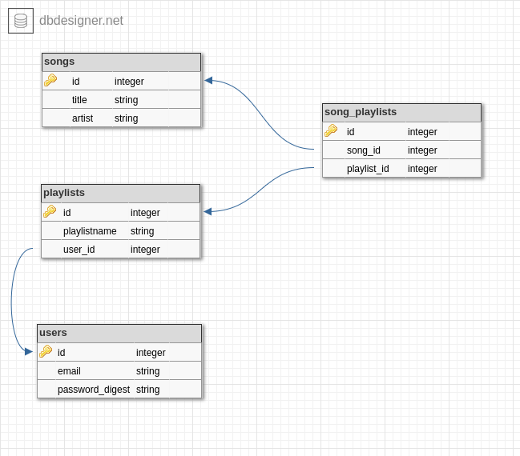

# Sanity Music App

## Project ERD

## Prerequisites
Run: `$ bundle install`, `$ rails db:migrate` and `$ rails db:seed` in your terminal console

## Resources
- Devise
- SQLite3

## Features/Functions
- Customised devise pages
- Authenticated user login
- Songs - CRUD
- Playlists - CRUD

## Misc
- Added song list in seeds.rb file
- Added nav bar with current_user logged in details
